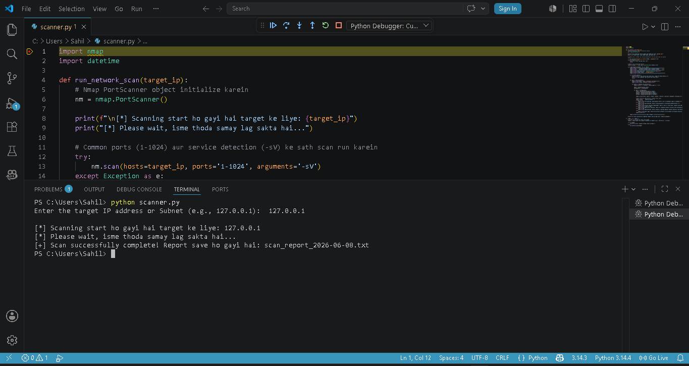
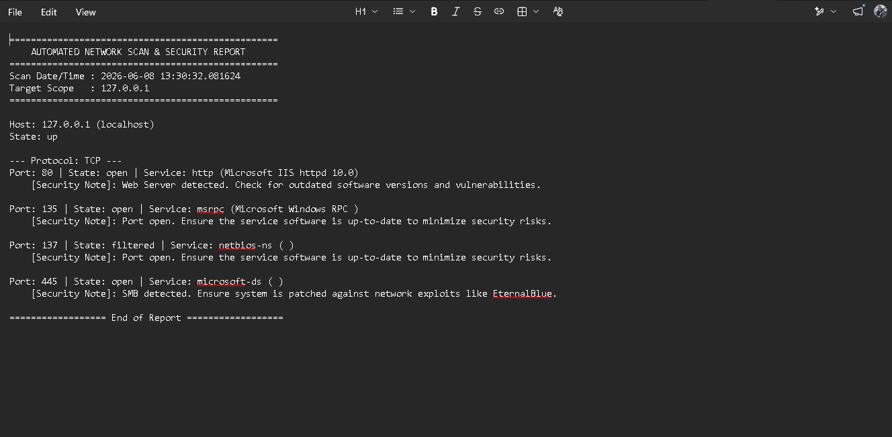

🛡️ Network Vulnerability Scanner
Ek automated Python-based network tool jo target IP addresses par scanning karta hai aur common security vulnerabilities (jaise open ports aur outdated services) ko detect karta hai.

🚀 Features
Automated Scanning: Nmap ka use karke fast aur accurate scanning.

Service Detection: Running services aur unke versions ko identify karna.

Vulnerability Insights: Detected ports ke basis par security notes generate karna (e.g., SMB/EternalBlue risk).

Automated Reporting: Scan results ko automatically .txt file mein save karna.

🛠️ Tools & Tech Stack
Language: Python 3

Library: python-nmap

Network Tool: Nmap

📋 How to Use
Prerequisites: Nmap install hona chahiye aur Python library install karein:

Bash
pip install python-nmap
Run Script:

Bash
python scanner.py
Input: Terminal mein apna target IP ya subnet range enter karein.

📊 Sample Output

## 📊 Sample Output

⚠️ Disclaimer
Ye tool sirf educational aur ethical hacking purposes ke liye hai. Iska use sirf un networks par karein jinka aapke paas legal access/permission ho.
